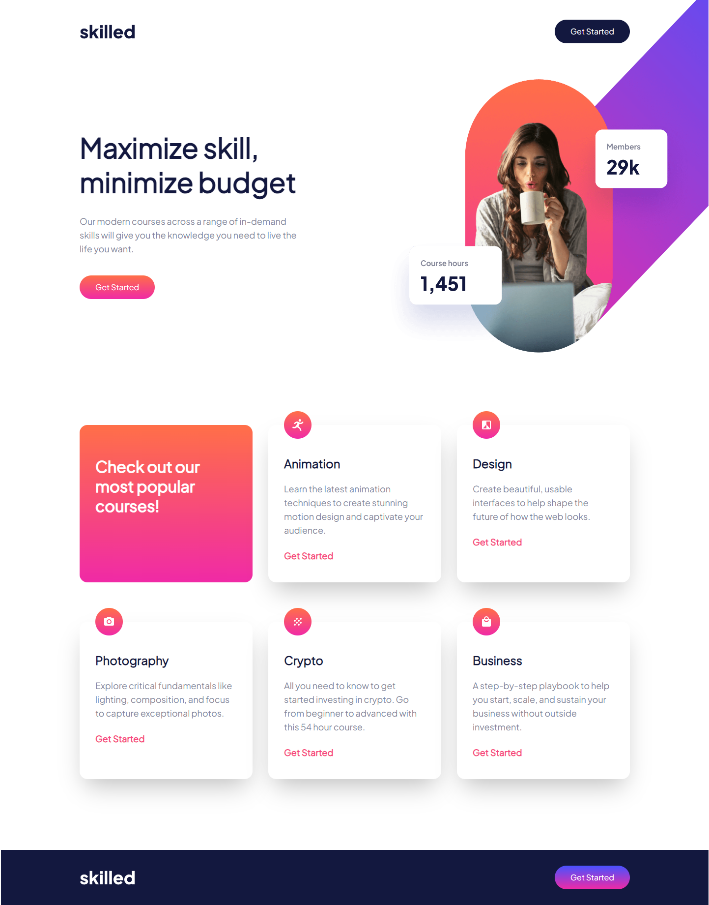

# Frontend Mentor - Skilled e-learning landing page solution

This is a solution to the [Skilled e-learning landing page challenge on Frontend Mentor](https://www.frontendmentor.io/challenges/skilled-elearning-landing-page-S1ObDrZ8q). Frontend Mentor challenges help you improve your coding skills by building realistic projects.

## Table of contents

- [Overview](#overview)
  - [The challenge](#the-challenge)
  - [Screenshot](#screenshot)
  - [Links](#links)
- [My process](#my-process)
  - [Built with](#built-with)
  - [What I learned](#what-i-learned)
  - [Continued development](#continued-development)
  - [Useful resources](#useful-resources)
- [Author](#author)

## Overview

### The challenge

Users should be able to:

- View the optimal layout depending on their device's screen size
- See hover states for interactive elements

### Screenshot



### Links

- Solution URL: [Add solution URL here](https://your-solution-url.com)
- Live Site URL: [Add live site URL here](https://your-live-site-url.com)

## My process

### Built with

- Semantic HTML5 markup
- Vite Bundler
- CSS custom properties
- Flexbox
- CSS Grid
- Mobile-first workflow
- [React](https://reactjs.org/) - JS library

### What I learned

During this project I had the experience of designing a responsive design with tailwindCSS and react framework. I used the simple file structure and tried to mifiy the classNames by having derivates and correct tailwind.config.js

```css
@layer components {
  .heading-xl {
    @apply text-[56px] leading-[70px] font-extrabold;
  }

  .heading-lg {
    @apply text-[40px] leading-[51px] font-extrabold;
  }

  .heading-md {
    @apply text-[32px] leading-[40px] font-extrabold;
  }

  .heading-sm {
    @apply text-2xl leading-[28px] font-extrabold;
  }

  .body-md {
    @apply text-lg leading-[28px] font-medium;
  }

  .body-sm {
    @apply text-base leading-[28px] font-medium;
  }

  .primaryGradient {
    @apply bg-gradient-to-b from-[#ff6f48] to-[#f02aa6];
  }

  .secondaryGradient {
    @apply bg-gradient-to-b from-[#4851ff] to-[#f02aa6];
  }

  .customShadow {
    box-shadow: 0px 25px 50px 0px rgba(6, 22, 141, 0.04);
  }
}
```

```js
/** @type {import('tailwindcss').Config} */
export default {
  content: ['./index.html', './src/**/*.{js,ts,jsx,tsx}'],
  theme: {
    extend: {
      colors: {
        darkBlue: '#13183F',
        lightBlue: '#666CA3',
        gray: '#83869A',
        pink: '#F74780',
        lightPink: '#FFA7C3',
      },
      fontFamily: {
        jakarta: ['Plus Jakarta', 'sans-serif'],
      },
    },
  },
  plugins: [],
};
```

### Continued development

The project has a reasonable responsive design right now, but it can use a better touch up later on.

### Useful resources

- [Tailwind](https://tailwindcss.com/) - This helped me for finding the correct classNames for better CSS design.
- [ChatGPT](https://www.example.com) - I used chatGPT in regard to finding the best approach for having the background picture for this webpage.

## Author

- Website - [Amir Taherian](https://github.com/Amirat9)
- Frontend Mentor - [@amira9](https://www.frontendmentor.io/profile/Amirat9)
